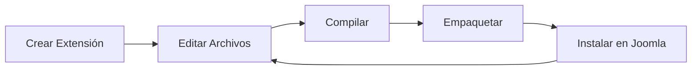

# 🚀 Tutorial Completo de jkit - Paso a Paso

> [!NOTE]
> Este es un tutorial práctico completo que te guía a través de todas las funcionalidades de jkit, desde la instalación hasta crear un proyecto completo multi-extensión de Joomla.

**Información del Tutorial:**
- ⏱️ **Duración**: 1-2 horas
- 📊 **Nivel**: Principiante a Intermedio
- 🎯 **Resultado**: Sistema de blog completo con 8 extensiones
- 📝 **Versión**: jkit 0.1.0

---

## Tabla de Contenidos

- [Requisitos Previos](#requisitos-previos)
- [Parte 1: Instalación](#parte-1-instalación)
- [Parte 2: Crear Tu Primer Proyecto](#parte-2-crear-tu-primer-proyecto)
- [Parte 3: Crear Extensiones](#parte-3-crear-extensiones)
  - [Componente](#paso-31-crear-un-componente-com_blog)
  - [Módulos](#paso-32-crear-un-módulo-de-sitio-mod_ultimos_posts)
  - [Plugins](#paso-34-crear-plugins)
  - [Plantilla](#paso-35-crear-una-plantilla-tpl_tema_blog)
  - [Biblioteca](#paso-36-crear-una-biblioteca-lib_utilidades_blog)
  - [Paquete](#paso-37-crear-un-paquete-pkg_miblog)
- [Parte 4: Ver Tu Proyecto Completo](#parte-4-ver-tu-proyecto-completo)
- [Parte 5: Configurar el Paquete](#parte-5-configurar-el-paquete)
- [Parte 6: Desarrollo y Compilación](#parte-6-desarrollo-y-compilación)
- [Parte 7: Crear Paquetes de Distribución](#parte-7-crear-paquetes-de-distribución)
- [Parte 8: Instalación en Joomla](#parte-8-instalación-en-joomla)
- [Parte 9: Trabajar con Archivos de Extensión](#parte-9-trabajar-con-archivos-de-extensión)
- [Parte 10: Comandos Útiles](#parte-10-comandos-útiles)
- [Parte 11: Consejos y Mejores Prácticas](#parte-11-consejos-y-mejores-prácticas)
- [Parte 12: Solución de Problemas](#parte-12-solución-de-problemas)
- [Parte 13: Proyecto de Ejemplo Completo](#parte-13-proyecto-de-ejemplo-completo)
- [Parte 14: Siguientes Pasos](#parte-14-siguientes-pasos)

---

## Requisitos Previos

> [!IMPORTANT]
> Antes de comenzar, asegúrate de tener instalado:

| Requisito | Versión Mínima | Comando de Verificación |
|-----------|---------------|------------------------|
| Node.js | >= 18 | `node --version` |
| npm | Última | `npm --version` |
| Git | Cualquiera | `git --version` |
| Docker | Última (opcional) | `docker --version` |
| VS Code | Última (opcional) | `code --version` |

**Verifica tu configuración:**

```bash
node --version  # Debe ser >= 18
npm --version
git --version
```

---

## Parte 1: Instalación

### Paso 1.1: Instalar jkit Globalmente

```bash
# Desde el directorio del proyecto jkit
cd /workspaces/joomla-devkit
npm install
npm run build
npm link
```

### Paso 1.2: Verificar Instalación

```bash
jkit --version
jkit --help
```

> [!TIP]
> Deberías ver la versión 0.1.0 y una lista de comandos disponibles.

---

## Parte 2: Crear Tu Primer Proyecto

### Paso 2.1: Inicializar un Nuevo Proyecto

Vamos a crear un proyecto llamado "miblog" - un sistema de blog completo para Joomla.

```bash
# Navega a tu directorio de trabajo (ej: /tmp)
cd /tmp

# Crea el proyecto
jkit init miblog

# Responde las preguntas:
# - Versión de Joomla: 5.0 (presiona Enter para default)
# - Nombre del autor: Tu Nombre
# - Email: tu@email.com
# - Saltar Dev Container: Y (para este tutorial)
```

### Paso 2.2: Explorar la Estructura Creada

```bash
cd miblog
tree -L 2
```

**Salida esperada:**

```
miblog/
├── src/                 # Aquí irán tus extensiones
├── dist/                # Paquetes compilados (.zip)
├── jkit.config.json     # Configuración del proyecto
├── package.json
└── README.md
```

### Paso 2.3: Ver la Configuración

```bash
cat jkit.config.json
```

---

## Parte 3: Crear Extensiones

Ahora vamos a crear un conjunto completo de extensiones para nuestro blog.

### Paso 3.1: Crear un Componente (com_blog)

El componente es el corazón de nuestro sistema de blog.

```bash
jkit create component com_blog

# Responde:
# - Descripción: "Componente de blog con artículos y categorías"
# - Namespace: (presiona Enter para usar auto-generado)
```

**Explorar lo creado:**

```bash
tree src/com_blog -L 2
```

<details>
<summary>📁 Haz clic para ver la estructura esperada</summary>

```
src/com_blog/
├── admin/               # Backend (administrador)
│   ├── src/
│   ├── tmpl/
│   └── sql/
├── site/                # Frontend (sitio)
│   ├── src/
│   └── tmpl/
├── media/               # Assets (CSS, JS)
│   ├── css/
│   └── js/
└── manifest.xml
```
</details>

### Paso 3.2: Crear un Módulo de Sitio (mod_ultimos_posts)

Un módulo para mostrar los últimos posts en el frontend.

```bash
jkit create module mod_ultimos_posts --client site

# Responde:
# - Descripción: "Mostrar últimos artículos del blog"
```

**Explorar:**

```bash
tree src/mod_ultimos_posts -L 2
cat src/mod_ultimos_posts/manifest.xml
```

> [!NOTE]
> Nota que el manifest tiene `client="site"`.

### Paso 3.3: Crear un Módulo de Administración (mod_estadisticas_blog)

Un módulo para el panel de administración.

```bash
jkit create module mod_estadisticas_blog --client administrator

# Responde:
# - Descripción: "Mostrar estadísticas del blog en el panel admin"
```

**Verificar:**

```bash
grep 'client=' src/mod_estadisticas_blog/manifest.xml
# Deberías ver: client="administrator"
```

### Paso 3.4: Crear Plugins

Vamos a crear dos plugins: uno del sistema y uno de contenido.

**Plugin de Sistema:**

```bash
jkit create plugin ayudante_blog --group system

# Responde:
# - Descripción: "Plugin del sistema para mejoras del blog"
```

**Plugin de Contenido:**

```bash
jkit create plugin compartir_social --group content

# Responde:
# - Descripción: "Añadir botones de compartir en redes sociales"
```

**Verificar plugins:**

```bash
ls -la src/plg_*

# Deberías ver:
# src/plg_content_compartir_social/
# src/plg_system_ayudante_blog/
```

> [!TIP]
> Los plugins automáticamente obtienen el prefijo `plg_<grupo>_<nombre>` para una organización adecuada.

### Paso 3.5: Crear una Plantilla (tpl_tema_blog)

```bash
jkit create template tema_blog --client site

# Responde:
# - Descripción: "Plantilla personalizada para el blog"
```

**Explorar la plantilla:**

```bash
tree src/tpl_tema_blog -L 1
```

<details>
<summary>📄 Haz clic para ver los archivos de la plantilla</summary>

- `index.php`
- `templateDetails.xml`
- `component.php`
- `error.php`
- `offline.php`
- `joomla.asset.json`
- `scss/`, `js/`, `css/`, etc.
</details>

### Paso 3.6: Crear una Biblioteca (lib_utilidades_blog)

```bash
jkit create library utilidades_blog

# Responde:
# - Descripción: "Utilidades compartidas para componentes del blog"
```

**Verificar:**

```bash
cat src/lib_utilidades_blog/manifest.xml | grep libraryname
# Deberías ver: <libraryname>utilidades_blog</libraryname>
```

### Paso 3.7: Crear un Paquete (pkg_miblog)

El paquete agrupa todas las extensiones en un único instalador.

```bash
jkit create package pkg_miblog

# Responde:
# - Descripción: "Paquete completo de blog con todas las extensiones"
```

**Explorar el paquete:**

```bash
cat src/pkg_miblog/manifest.xml
cat src/pkg_miblog/script.php
cat src/pkg_miblog/README.md
```

---

## Parte 4: Ver Tu Proyecto Completo

### Paso 4.1: Listar Todas las Extensiones

```bash
tree src/ -L 1
```

**Deberías ver:**

```
src/
├── com_blog/
├── mod_ultimos_posts/
├── mod_estadisticas_blog/
├── plg_system_ayudante_blog/
├── plg_content_compartir_social/
├── tpl_tema_blog/
├── lib_utilidades_blog/
└── pkg_miblog/
```

### Paso 4.2: Ver la Configuración Actualizada

```bash
cat jkit.config.json
```

> [!NOTE]
> Verás todas las extensiones registradas con su metadata.

---

## Parte 5: Configurar el Paquete

### Paso 5.1: Editar el Manifest del Paquete

Vamos a agregar las extensiones al paquete para que se instalen juntas.

```bash
# Abre el manifest en tu editor favorito
nano src/pkg_miblog/manifest.xml
# O usa: code src/pkg_miblog/manifest.xml
```

**Reemplaza la sección `<files folder="packages">` con:**

```xml
<files folder="packages">
    <!-- Componente -->
    <file type="component" id="com_blog">com_blog.zip</file>

    <!-- Módulos -->
    <file type="module" id="mod_ultimos_posts" client="site">mod_ultimos_posts.zip</file>
    <file type="module" id="mod_estadisticas_blog" client="administrator">mod_estadisticas_blog.zip</file>

    <!-- Plugins -->
    <file type="plugin" id="ayudante_blog" group="system">plg_system_ayudante_blog.zip</file>
    <file type="plugin" id="compartir_social" group="content">plg_content_compartir_social.zip</file>

    <!-- Plantilla -->
    <file type="template" id="tema_blog" client="site">tpl_tema_blog.zip</file>

    <!-- Biblioteca -->
    <file type="library" id="utilidades_blog">lib_utilidades_blog.zip</file>
</files>
```

**Guardar y cerrar** (Ctrl+X, Y, Enter en nano).

---

## Parte 6: Desarrollo y Compilación

### Paso 6.1: Modo Desarrollo (Opcional)

Si quieres trabajar con Hot Module Replacement:

```bash
# Para una extensión específica
jkit dev com_blog

# O para todo el proyecto
jkit dev

# Presiona Ctrl+C para detener
```

> [!TIP]
> El modo desarrollo observa cambios en archivos y recompila automáticamente.

### Paso 6.2: Compilar Extensiones

```bash
# Compilar todas las extensiones
jkit build

# O compilar una específica
jkit build com_blog
```

**Ver resultados:**

```bash
ls -lh dist/
# Deberías ver archivos .zip para cada extensión
```

---

## Parte 7: Crear Paquetes de Distribución

### Paso 7.1: Empaquetar Todas las Extensiones

```bash
jkit package

# Esto crea archivos .zip en dist/ para cada extensión
```

### Paso 7.2: Verificar Paquetes Creados

```bash
ls -lh dist/*.zip
```

**Archivos esperados:**

- ✅ `com_blog.zip`
- ✅ `mod_ultimos_posts.zip`
- ✅ `mod_estadisticas_blog.zip`
- ✅ `plg_system_ayudante_blog.zip`
- ✅ `plg_content_compartir_social.zip`
- ✅ `tpl_tema_blog.zip`
- ✅ `lib_utilidades_blog.zip`
- ✅ `pkg_miblog.zip` ← **Este contiene todos los demás**

---

## Parte 8: Instalación en Joomla

### Paso 8.1: Preparar para Instalar

```bash
# Verifica que tienes el paquete principal
ls -lh dist/pkg_miblog.zip
```

### Paso 8.2: Instalar en Joomla (Pasos)

> [!IMPORTANT]
> Sigue estos pasos en tu administrador de Joomla:

1. Accede al administrador de tu sitio Joomla
2. Ve a **Sistema → Instalar → Extensiones**
3. Sube el archivo `dist/pkg_miblog.zip`
4. Joomla instalará automáticamente todas las extensiones incluidas
5. Verifica en **Sistema → Extensiones** que todo se instaló correctamente

---

## Parte 9: Trabajar con Archivos de Extensión

### Paso 9.1: Editar un Componente

```bash
# Ver estructura del componente
tree src/com_blog/admin/src -L 2

# Editar un controlador (ejemplo)
nano src/com_blog/admin/src/Controller/DisplayController.php
```

### Paso 9.2: Añadir Estilos a un Módulo

```bash
# Crear un archivo CSS
echo "/* Estilos del Módulo de Últimos Posts */
.mod-ultimos-posts {
    padding: 15px;
    border: 1px solid #ddd;
    border-radius: 5px;
}
" > src/mod_ultimos_posts/media/css/module.css
```

### Paso 9.3: Añadir JavaScript a la Plantilla

```bash
# Editar el archivo JS principal
echo "// JavaScript del Tema del Blog
document.addEventListener('DOMContentLoaded', function() {
    console.log('Tema del Blog Cargado');
});
" > src/tpl_tema_blog/js/template.js
```

### Paso 9.4: Recompilar Después de Cambios

```bash
# Recompilar todo
jkit build

# O recompilar solo lo que cambiaste
jkit build mod_ultimos_posts
jkit build tpl_tema_blog
```

---

## Parte 10: Comandos Útiles

### Resumen de Comandos jkit

| Comando | Descripción | Ejemplo |
|---------|-------------|---------|
| `jkit init <nombre>` | Crear nuevo proyecto | `jkit init miblog` |
| `jkit create <tipo> <nombre>` | Crear extensión | `jkit create component com_blog` |
| `jkit dev [nombre]` | Desarrollo con HMR | `jkit dev` |
| `jkit build [nombre]` | Compilar extensión | `jkit build com_blog` |
| `jkit package [nombre]` | Crear paquete .zip | `jkit package` |
| `jkit --version` | Mostrar versión | `jkit --version` |
| `jkit --help` | Mostrar ayuda | `jkit --help` |

### Opciones Comunes

```bash
# Modo no interactivo (útil para CI/CD)
jkit init miblog \
  --author "Juan Pérez" \
  --email "juan@ejemplo.com" \
  --no-devcontainer

jkit create component com_prueba \
  --author "Juan Pérez" \
  --email "juan@ejemplo.com" \
  --description "Componente de prueba" \
  --license "GPL-2.0-or-later"

# Opciones específicas de extensiones
--client site|administrator  # Para módulos y plantillas
--group <grupo>              # Para plugins (system, content, etc.)
--namespace <namespace>      # Namespace PHP personalizado
```

---

## Parte 11: Consejos y Mejores Prácticas

### 11.1: Estructura de Directorios

> [!TIP]
> **Hacer:**
> - Mantén cada extensión en su propio directorio en `src/`
> - Usa nombres descriptivos (com_blog, no com_b)
> - Sigue las convenciones de Joomla para prefijos

> [!WARNING]
> **No hacer:**
> - No edites archivos en `dist/` (se sobrescriben al compilar)
> - No mezcles código de diferentes extensiones

### 11.2: Desarrollo Iterativo

**Flujo de trabajo recomendado:**



```bash
1. jkit create <tipo> <nombre>  # Crear extensión
2. Editar archivos en src/<nombre>/
3. jkit build <nombre>           # Compilar
4. jkit package <nombre>         # Empaquetar
5. Instalar en Joomla de prueba
6. Repetir desde paso 2
```

### 11.3: Control de Versiones

```bash
# Inicializar git si no lo has hecho
git init
git add .
git commit -m "Commit inicial: proyecto miblog"

# .gitignore recomendado (ya incluido)
node_modules/
dist/
.devcontainer/
```

### 11.4: Namespaces

Los namespaces se generan automáticamente siguiendo la convención:

| Tipo de Extensión | Patrón de Namespace |
|-------------------|---------------------|
| Componente | `Autor\Component\Blog\Administrator\...` |
|            | `Autor\Component\Blog\Site\...` |
| Módulo | `Autor\Module\UltimosPosts\...` |
| Plugin | `Autor\Plugin\System\AyudanteBlog\...` |
| Plantilla | `Autor\Template\TemaBlog\...` |
| Biblioteca | `Autor\Library\UtilidadesBlog\...` |

---

## Parte 12: Solución de Problemas

### Problema: "Command not found: jkit"

> [!NOTE]
> **Solución:** Reinstalar y vincular

```bash
cd /workspaces/joomla-devkit
npm run build
npm link
```

### Problema: "Template not found"

> [!NOTE]
> **Solución:** Asegúrate de estar en el directorio del proyecto

```bash
pwd  # Debe mostrar tu proyecto, ej: /tmp/miblog
ls jkit.config.json  # Debe existir
```

### Problema: "Extension already exists"

> [!NOTE]
> **Solución:** Elimina la extensión existente o usa otro nombre

```bash
rm -rf src/com_nombre
# O edita jkit.config.json y elimina la entrada
```

### Problema: Build Falla

> [!NOTE]
> **Solución:** Verifica dependencias y recompila limpiamente

```bash
# Verifica dependencias
npm install

# Limpia y recompila
rm -rf dist/*
jkit build
```

---

## Parte 13: Proyecto de Ejemplo Completo

Aquí está un resumen del proyecto que acabamos de crear:

```
📦 miblog - Sistema de Blog Completo
├─ 🔷 com_blog                       - Componente principal
├─ 📦 mod_ultimos_posts              - Módulo: últimos posts (sitio)
├─ 📦 mod_estadisticas_blog          - Módulo: estadísticas (admin)
├─ 🔌 plg_system_ayudante_blog       - Plugin sistema
├─ 🔌 plg_content_compartir_social   - Plugin contenido
├─ 🎨 tpl_tema_blog                  - Plantilla del blog
├─ 📚 lib_utilidades_blog            - Biblioteca compartida
└─ 📦 pkg_miblog                     - Paquete todo-en-uno
```

**Instalación:** Un solo archivo ZIP instala todo.

---

## Parte 14: Siguientes Pasos

### Aprender Más

1. **Documentación Oficial de Joomla (español):**
   - https://docs.joomla.org/
   - Busca la sección de desarrollo de extensiones

2. **Explorar Plantillas Generadas:**
   - Revisa los archivos en `src/templates/extension/` de jkit
   - Estudia la estructura de cada tipo de extensión

3. **Personalizar Configuración:**
   - Edita `jkit.config.json` para defaults del proyecto
   - Añade configuraciones de Vite personalizadas

### Contribuir a jkit

```bash
# Fork y clone el repositorio
git clone https://github.com/alebak/joomla-devkit
cd joomla-devkit

# Crea una rama para tu feature
git checkout -b feature/mi-mejora

# Haz tus cambios y pruebas
npm test

# Commit y push
git commit -m "feat: mi mejora"
git push origin feature/mi-mejora

# Crea un Pull Request en GitHub
```

---

## 🎉 ¡Felicitaciones!

Has completado el tutorial completo de **jkit**. Ahora sabes cómo:

- ✅ Inicializar proyectos de Joomla
- ✅ Crear los 6 tipos de extensiones
- ✅ Configurar paquetes multi-extensión
- ✅ Compilar y empaquetar para distribución
- ✅ Trabajar con el flujo de desarrollo

---

## 📚 Recursos Adicionales

| Recurso | Descripción |
|---------|-------------|
| [README.md](../README.md) | Documentación principal |
| [ROADMAP.md](../ROADMAP.md) | Características planeadas |
| [TESTING_KNOWN_ISSUES.md](TESTING_KNOWN_ISSUES.md) | Problemas conocidos |
| [CONTRIBUTING.md](../CONTRIBUTING.md) | Guías de contribución |

---

**Última Actualización:** 2025-11-24
**Versión de jkit:** 0.1.0
**Autor:** alebak
**Licencia:** GPL-2.0-or-later

> [!TIP]
> 💡 ¿Te resultó útil este tutorial? Dale una estrella al repositorio y compártelo con otros desarrolladores de Joomla!
