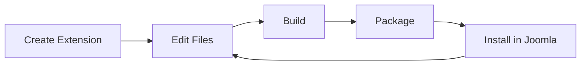

# 🚀 Complete jkit Tutorial - Step by Step

> [!NOTE]
> This is a comprehensive hands-on tutorial that guides you through all jkit features from installation to creating a complete multi-extension Joomla project.

**Tutorial Information:**
- ⏱️ **Duration**: 1-2 hours
- 📊 **Level**: Beginner to Intermediate
- 🎯 **Outcome**: Complete blog system with 8 extensions
- 📝 **Version**: jkit 0.1.0

---

## Table of Contents

- [Prerequisites](#prerequisites)
- [Part 1: Installation](#part-1-installation)
- [Part 2: Create Your First Project](#part-2-create-your-first-project)
- [Part 3: Create Extensions](#part-3-create-extensions)
  - [Component](#step-31-create-a-component-com_blog)
  - [Modules](#step-32-create-a-site-module-mod_latest_posts)
  - [Plugins](#step-34-create-plugins)
  - [Template](#step-35-create-a-template-tpl_blogtheme)
  - [Library](#step-36-create-a-library-lib_blogutils)
  - [Package](#step-37-create-a-package-pkg_myblog)
- [Part 4: View Your Complete Project](#part-4-view-your-complete-project)
- [Part 5: Configure the Package](#part-5-configure-the-package)
- [Part 6: Development and Build](#part-6-development-and-build)
- [Part 7: Create Distribution Packages](#part-7-create-distribution-packages)
- [Part 8: Install in Joomla](#part-8-install-in-joomla)
- [Part 9: Work with Extension Files](#part-9-work-with-extension-files)
- [Part 10: Useful Commands](#part-10-useful-commands)
- [Part 11: Tips and Best Practices](#part-11-tips-and-best-practices)
- [Part 12: Troubleshooting](#part-12-troubleshooting)
- [Part 13: Complete Example Project](#part-13-complete-example-project)
- [Part 14: Next Steps](#part-14-next-steps)

---

## Prerequisites

> [!IMPORTANT]
> Before starting, ensure you have installed:

| Requirement | Minimum Version | Check Command |
|------------|----------------|---------------|
| Node.js | >= 18 | `node --version` |
| npm | Latest | `npm --version` |
| Git | Any | `git --version` |
| Docker | Latest (optional) | `docker --version` |
| VS Code | Latest (optional) | `code --version` |

**Verify your setup:**

```bash
node --version  # Must be >= 18
npm --version
git --version
```

---

## Part 1: Installation

### Step 1.1: Install jkit Globally

```bash
# From the jkit project directory
cd /workspaces/joomla-devkit
npm install
npm run build
npm link
```

### Step 1.2: Verify Installation

```bash
jkit --version
jkit --help
```

> [!TIP]
> You should see version 0.1.0 and a list of available commands.

---

## Part 2: Create Your First Project

### Step 2.1: Initialize a New Project

We'll create a project called "myblog" - a complete blog system for Joomla.

```bash
# Navigate to your working directory (e.g., /tmp)
cd /tmp

# Create the project
jkit init myblog

# Answer the questions:
# - Joomla version: 5.0 (press Enter for default)
# - Author name: Your Name
# - Email: your@email.com
# - Skip Dev Container: Y (for this tutorial)
```

### Step 2.2: Explore the Created Structure

```bash
cd myblog
tree -L 2
```

**Expected output:**

```
myblog/
├── src/                 # Your extensions will go here
├── dist/                # Compiled packages (.zip files)
├── jkit.config.json     # Project configuration
├── package.json
└── README.md
```

### Step 2.3: View Configuration

```bash
cat jkit.config.json
```

---

## Part 3: Create Extensions

Now we'll create a complete set of extensions for our blog system.

### Step 3.1: Create a Component (com_blog)

The component is the heart of our blog system.

```bash
jkit create component com_blog

# Answer:
# - Description: "Blog component with posts and categories"
# - Namespace: (press Enter to use auto-generated)
```

**Explore what was created:**

```bash
tree src/com_blog -L 2
```

<details>
<summary>📁 Click to see expected structure</summary>

```
src/com_blog/
├── admin/               # Backend
│   ├── src/
│   ├── tmpl/
│   └── sql/
├── site/                # Frontend
│   ├── src/
│   └── tmpl/
├── media/               # Assets
│   ├── css/
│   └── js/
└── manifest.xml
```
</details>

### Step 3.2: Create a Site Module (mod_latest_posts)

A module to display latest posts on the frontend.

```bash
jkit create module mod_latest_posts --client site

# Answer:
# - Description: "Display latest blog posts"
```

**Explore:**

```bash
tree src/mod_latest_posts -L 2
cat src/mod_latest_posts/manifest.xml
```

> [!NOTE]
> Notice the manifest has `client="site"`.

### Step 3.3: Create an Administrator Module (mod_blog_stats)

A module for the admin dashboard.

```bash
jkit create module mod_blog_stats --client administrator

# Answer:
# - Description: "Show blog statistics in admin dashboard"
```

**Verify:**

```bash
grep 'client=' src/mod_blog_stats/manifest.xml
# Should show: client="administrator"
```

### Step 3.4: Create Plugins

We'll create two plugins: system and content.

**System Plugin:**

```bash
jkit create plugin bloghelper --group system

# Answer:
# - Description: "System plugin for blog enhancements"
```

**Content Plugin:**

```bash
jkit create plugin socialshare --group content

# Answer:
# - Description: "Add social sharing buttons to articles"
```

**Verify plugins:**

```bash
ls -la src/plg_*

# You should see:
# src/plg_content_socialshare/
# src/plg_system_bloghelper/
```

> [!TIP]
> Plugins automatically get the `plg_<group>_<name>` prefix for proper organization.

### Step 3.5: Create a Template (tpl_blogtheme)

```bash
jkit create template blogtheme --client site

# Answer:
# - Description: "Custom blog theme for Joomla"
```

**Explore the template:**

```bash
tree src/tpl_blogtheme -L 1
```

<details>
<summary>📄 Click to see template files</summary>

- `index.php`
- `templateDetails.xml`
- `component.php`
- `error.php`
- `offline.php`
- `joomla.asset.json`
- `scss/`, `js/`, `css/`, etc.
</details>

### Step 3.6: Create a Library (lib_blogutils)

```bash
jkit create library blogutils

# Answer:
# - Description: "Shared utilities for blog components"
```

**Verify:**

```bash
cat src/lib_blogutils/manifest.xml | grep libraryname
# Should show: <libraryname>blogutils</libraryname>
```

### Step 3.7: Create a Package (pkg_myblog)

The package bundles all extensions into a single installer.

```bash
jkit create package pkg_myblog

# Answer:
# - Description: "Complete blog package with all extensions"
```

**Explore the package:**

```bash
cat src/pkg_myblog/manifest.xml
cat src/pkg_myblog/script.php
cat src/pkg_myblog/README.md
```

---

## Part 4: View Your Complete Project

### Step 4.1: List All Extensions

```bash
tree src/ -L 1
```

**You should see:**

```
src/
├── com_blog/
├── mod_latest_posts/
├── mod_blog_stats/
├── plg_system_bloghelper/
├── plg_content_socialshare/
├── tpl_blogtheme/
├── lib_blogutils/
└── pkg_myblog/
```

### Step 4.2: View Updated Configuration

```bash
cat jkit.config.json
```

> [!NOTE]
> You'll see all extensions registered with their metadata.

---

## Part 5: Configure the Package

### Step 5.1: Edit the Package Manifest

Let's add the extensions to the package so they install together.

```bash
# Open the manifest in your favorite editor
nano src/pkg_myblog/manifest.xml
# Or use: code src/pkg_myblog/manifest.xml
```

**Replace the `<files folder="packages">` section with:**

```xml
<files folder="packages">
    <!-- Component -->
    <file type="component" id="com_blog">com_blog.zip</file>

    <!-- Modules -->
    <file type="module" id="mod_latest_posts" client="site">mod_latest_posts.zip</file>
    <file type="module" id="mod_blog_stats" client="administrator">mod_blog_stats.zip</file>

    <!-- Plugins -->
    <file type="plugin" id="bloghelper" group="system">plg_system_bloghelper.zip</file>
    <file type="plugin" id="socialshare" group="content">plg_content_socialshare.zip</file>

    <!-- Template -->
    <file type="template" id="blogtheme" client="site">tpl_blogtheme.zip</file>

    <!-- Library -->
    <file type="library" id="blogutils">lib_blogutils.zip</file>
</files>
```

**Save and close** (Ctrl+X, Y, Enter in nano).

---

## Part 6: Development and Build

### Step 6.1: Development Mode (Optional)

If you want to work with Hot Module Replacement:

```bash
# For a specific extension
jkit dev com_blog

# Or for the entire project
jkit dev

# Press Ctrl+C to stop
```

> [!TIP]
> Development mode watches for file changes and automatically rebuilds.

### Step 6.2: Build Extensions

```bash
# Build all extensions
jkit build

# Or build a specific one
jkit build com_blog
```

**View results:**

```bash
ls -lh dist/
# You should see .zip files for each extension
```

---

## Part 7: Create Distribution Packages

### Step 7.1: Package All Extensions

```bash
jkit package

# This creates .zip files in dist/ for each extension
```

### Step 7.2: Verify Created Packages

```bash
ls -lh dist/*.zip
```

**Expected files:**

- ✅ `com_blog.zip`
- ✅ `mod_latest_posts.zip`
- ✅ `mod_blog_stats.zip`
- ✅ `plg_system_bloghelper.zip`
- ✅ `plg_content_socialshare.zip`
- ✅ `tpl_blogtheme.zip`
- ✅ `lib_blogutils.zip`
- ✅ `pkg_myblog.zip` ← **This contains all the others**

---

## Part 8: Install in Joomla

### Step 8.1: Prepare to Install

```bash
# Verify you have the main package
ls -lh dist/pkg_myblog.zip
```

### Step 8.2: Install in Joomla (Conceptual Steps)

> [!IMPORTANT]
> Follow these steps in your Joomla administrator:

1. Access your Joomla administrator
2. Go to **System → Install → Extensions**
3. Upload the file `dist/pkg_myblog.zip`
4. Joomla will automatically install all included extensions
5. Verify in **System → Extensions** that everything installed correctly

---

## Part 9: Work with Extension Files

### Step 9.1: Edit a Component

```bash
# View component structure
tree src/com_blog/admin/src -L 2

# Edit a controller (example)
nano src/com_blog/admin/src/Controller/DisplayController.php
```

### Step 9.2: Add Styles to a Module

```bash
# Create a CSS file
echo "/* Latest Posts Module Styles */
.mod-latest-posts {
    padding: 15px;
    border: 1px solid #ddd;
}
" > src/mod_latest_posts/media/css/module.css
```

### Step 9.3: Add JavaScript to Template

```bash
# Edit the main JS file
echo "// Blog Theme JavaScript
document.addEventListener('DOMContentLoaded', function() {
    console.log('Blog Theme Loaded');
});
" > src/tpl_blogtheme/js/template.js
```

### Step 9.4: Rebuild After Changes

```bash
# Rebuild everything
jkit build

# Or rebuild only what you changed
jkit build mod_latest_posts
jkit build tpl_blogtheme
```

---

## Part 10: Useful Commands

### jkit Commands Summary

| Command | Description | Example |
|---------|-------------|---------|
| `jkit init <name>` | Create new project | `jkit init myblog` |
| `jkit create <type> <name>` | Create extension | `jkit create component com_blog` |
| `jkit dev [name]` | Development with HMR | `jkit dev` |
| `jkit build [name]` | Compile extension | `jkit build com_blog` |
| `jkit package [name]` | Create .zip package | `jkit package` |
| `jkit --version` | Show version | `jkit --version` |
| `jkit --help` | Show help | `jkit --help` |

### Common Options

```bash
# Non-interactive mode (useful for CI/CD)
jkit init myblog \
  --author "John Doe" \
  --email "john@example.com" \
  --no-devcontainer

jkit create component com_test \
  --author "John Doe" \
  --email "john@example.com" \
  --description "Test component" \
  --license "GPL-2.0-or-later"

# Extension-specific options
--client site|administrator  # For modules and templates
--group <group>              # For plugins (system, content, etc.)
--namespace <namespace>      # Custom PHP namespace
```

---

## Part 11: Tips and Best Practices

### 11.1: Directory Structure

> [!TIP]
> **Do:**
> - Keep each extension in its own directory in `src/`
> - Use descriptive names (com_blog, not com_b)
> - Follow Joomla conventions for prefixes

> [!WARNING]
> **Don't:**
> - Edit files in `dist/` (they get overwritten on build)
> - Mix code from different extensions

### 11.2: Iterative Development

**Recommended workflow:**



```bash
1. jkit create <type> <name>  # Create extension
2. Edit files in src/<name>/
3. jkit build <name>           # Build
4. jkit package <name>         # Package
5. Install in test Joomla
6. Repeat from step 2
```

### 11.3: Version Control

```bash
# Initialize git if you haven't
git init
git add .
git commit -m "Initial commit: myblog project"

# Recommended .gitignore (already included)
node_modules/
dist/
.devcontainer/
```

### 11.4: Namespaces

Namespaces are auto-generated following convention:

| Extension Type | Namespace Pattern |
|----------------|-------------------|
| Component | `Author\Component\Blog\Administrator\...` |
|           | `Author\Component\Blog\Site\...` |
| Module | `Author\Module\LatestPosts\...` |
| Plugin | `Author\Plugin\System\Bloghelper\...` |
| Template | `Author\Template\Blogtheme\...` |
| Library | `Author\Library\Blogutils\...` |

---

## Part 12: Troubleshooting

### Problem: "Command not found: jkit"

> [!NOTE]
> **Solution:** Reinstall and link

```bash
cd /workspaces/joomla-devkit
npm run build
npm link
```

### Problem: "Template not found"

> [!NOTE]
> **Solution:** Make sure you're in the project directory

```bash
pwd  # Should show your project, e.g., /tmp/myblog
ls jkit.config.json  # Should exist
```

### Problem: "Extension already exists"

> [!NOTE]
> **Solution:** Delete existing extension or use another name

```bash
rm -rf src/com_name
# Or edit jkit.config.json and remove the entry
```

### Problem: Build Fails

> [!NOTE]
> **Solution:** Verify dependencies and clean rebuild

```bash
# Verify dependencies
npm install

# Clean and rebuild
rm -rf dist/*
jkit build
```

---

## Part 13: Complete Example Project

Here's a summary of the project we just created:

```
📦 myblog - Complete Blog System
├─ 🔷 com_blog              - Main component
├─ 📦 mod_latest_posts      - Module: latest posts (site)
├─ 📦 mod_blog_stats        - Module: statistics (admin)
├─ 🔌 plg_system_bloghelper - System plugin
├─ 🔌 plg_content_socialshare - Content plugin
├─ 🎨 tpl_blogtheme         - Blog template
├─ 📚 lib_blogutils         - Shared library
└─ 📦 pkg_myblog            - All-in-one package
```

**Installation:** One ZIP file installs everything.

---

## Part 14: Next Steps

### Learn More

1. **Official Joomla Documentation:**
   - https://docs.joomla.org/
   - Especially the extension development section

2. **Explore Generated Templates:**
   - Review files in `src/templates/extension/` of jkit
   - Study the structure of each extension type

3. **Customize Configuration:**
   - Edit `jkit.config.json` for project defaults
   - Add custom Vite configurations

### Contribute to jkit

```bash
# Fork and clone the repository
git clone https://github.com/alebak/joomla-devkit
cd joomla-devkit

# Create a branch for your feature
git checkout -b feature/my-improvement

# Make changes and test
npm test

# Commit and push
git commit -m "feat: my improvement"
git push origin feature/my-improvement

# Create a Pull Request
```

---

## 🎉 Congratulations!

You've completed the complete **jkit** tutorial. Now you know how to:

- ✅ Initialize Joomla projects
- ✅ Create all 6 extension types
- ✅ Configure multi-extension packages
- ✅ Build and package for distribution
- ✅ Work with the development workflow

---

## 📚 Additional Resources

| Resource | Description |
|----------|-------------|
| [README.md](../README.md) | Main documentation |
| [ROADMAP.md](../ROADMAP.md) | Planned features |
| [TESTING_KNOWN_ISSUES.md](TESTING_KNOWN_ISSUES.md) | Known issues |
| [CONTRIBUTING.md](../CONTRIBUTING.md) | Contribution guidelines |

---

**Last Updated:** 2025-11-24
**jkit Version:** 0.1.0
**Author:** alebak
**License:** GPL-2.0-or-later

> [!TIP]
> 💡 Found this tutorial helpful? Star the repository and share with other Joomla developers!
