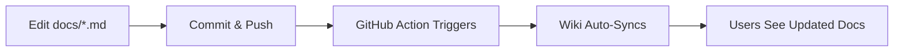

# 🛠️ Scripts

Utility scripts for joomla-devkit development and maintenance.

## Available Scripts

### setup-wiki.sh

Initialize or sync the GitHub Wiki with documentation from the `docs/` folder.

**Usage:**

```bash
# From the repository root
./scripts/setup-wiki.sh
```

**What it does:**
1. Clones the wiki repository
2. Copies documentation files from `docs/` to wiki
3. Creates wiki structure (Home, Sidebar, Footer)
4. Commits and pushes to GitHub Wiki

**When to use:**
- First-time wiki setup
- Manual sync of documentation
- After making significant docs changes (if automatic sync fails)

**Requirements:**
- Git configured with GitHub credentials
- Write access to the repository
- Wiki feature enabled in GitHub repository settings

**Note:** After initial setup, the GitHub Action (`.github/workflows/sync-wiki.yml`) will automatically sync documentation on every push to `main`.

## GitHub Actions

### sync-wiki.yml

Automatically synchronizes documentation from `docs/` folder to GitHub Wiki.

**Triggers:**
- Push to `main` or `master` branch with changes in `docs/**`
- Manual trigger via GitHub Actions UI

**What it syncs:**
- `docs/TUTORIAL_GITHUB.md` → `Tutorial.md`
- `docs/TUTORIAL_GITHUB.es.md` → `Tutorial-Spanish.md`
- `docs/TESTING_KNOWN_ISSUES.md` → `Testing-Known-Issues.md`
- Regenerates `Home.md`, `_Sidebar.md`, `_Footer.md`

**How to manually trigger:**
1. Go to GitHub repository
2. Click "Actions" tab
3. Select "Sync Documentation to Wiki"
4. Click "Run workflow"

## Documentation Workflow

### Making Changes to Documentation



### Step-by-Step:

1. **Edit documentation:**
   ```bash
   # Edit files in docs/ folder
   code docs/TUTORIAL_GITHUB.md
   ```

2. **Test locally:**
   ```bash
   # Preview with grip (optional)
   pip install grip
   grip docs/TUTORIAL_GITHUB.md
   ```

3. **Commit changes:**
   ```bash
   git add docs/
   git commit -m "docs: update tutorial"
   ```

4. **Push to main:**
   ```bash
   git push origin main
   ```

5. **Automatic sync:**
   - GitHub Action automatically runs
   - Wiki is updated within 1-2 minutes
   - Check Actions tab for status

### Verifying Sync

**Check GitHub Action:**
```
Repository → Actions → Sync Documentation to Wiki → Latest run
```

**View Wiki:**
```
https://github.com/alebak/joomla-devkit/wiki
```

## Troubleshooting

### Wiki sync fails with "repository not found"

**Solution:** Enable wiki in repository settings:
1. Go to repository Settings
2. Scroll to Features section
3. Check "Wikis" checkbox
4. Create initial page via web interface
5. Re-run sync

### Manual sync needed

**Solution:** Run setup script:
```bash
./scripts/setup-wiki.sh
```

### Permission denied

**Solution:** Ensure script is executable:
```bash
chmod +x scripts/setup-wiki.sh
```

### Changes not appearing in wiki

**Solution:** Check these:
1. GitHub Action completed successfully (Actions tab)
2. You pushed to `main` or `master` branch
3. Changes were in `docs/` folder
4. Wiki is enabled in repository settings

## File Structure

```
joomla-devkit/
├── .github/
│   └── workflows/
│       └── sync-wiki.yml        # Auto-sync workflow
├── docs/
│   ├── TUTORIAL_GITHUB.md       # Source: English tutorial
│   ├── TUTORIAL_GITHUB.es.md    # Source: Spanish tutorial
│   └── TESTING_KNOWN_ISSUES.md  # Source: Known issues
└── scripts/
    ├── README.md                # This file
    └── setup-wiki.sh            # Manual setup script
```

**Wiki Repository** (separate Git repo):
```
joomla-devkit.wiki/
├── Home.md                      # Generated: Wiki home page
├── Tutorial.md                  # Synced from TUTORIAL_GITHUB.md
├── Tutorial-Spanish.md          # Synced from TUTORIAL_GITHUB.es.md
├── Testing-Known-Issues.md      # Synced from TESTING_KNOWN_ISSUES.md
├── _Sidebar.md                  # Generated: Navigation sidebar
└── _Footer.md                   # Generated: Page footer
```

## Best Practices

### Documentation Updates

1. **Always edit source files** in `docs/` folder, not wiki directly
2. **Use GitHub-optimized versions** (`TUTORIAL_GITHUB.*`) as source
3. **Test changes locally** before pushing
4. **Verify sync** after pushing

### Wiki Pages

1. **Don't edit wiki directly** via GitHub web interface (changes will be overwritten)
2. **Use source files** in `docs/` as single source of truth
3. **Let automation handle** the sync

### Adding New Documentation

1. Create file in `docs/` folder
2. Update `sync-wiki.yml` to include new file:
   ```yaml
   - name: Sync documentation files to wiki
     run: |
       cp ../docs/NEW_FILE.md ./New-Page.md
   ```
3. Update sidebar in `sync-wiki.yml`:
   ```markdown
   - [New Page](New-Page)
   ```

## Questions?

- **Issues**: https://github.com/alebak/joomla-devkit/issues
- **Contributing**: See [CONTRIBUTING.md](../CONTRIBUTING.md)

---

**Last Updated:** 2025-11-24
